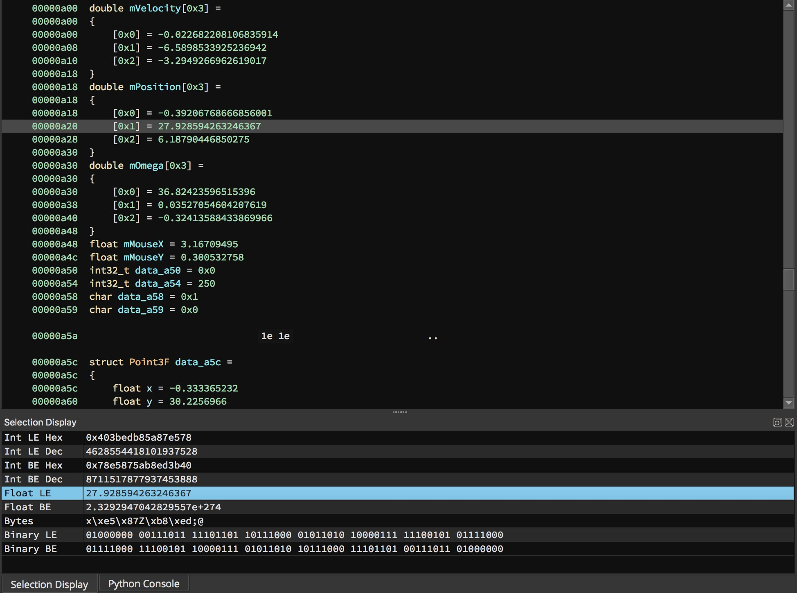

Selection Display
--

This is a basic utility to add functionality like Hex Fiend's data inspector to Binja.

Currently this ui is super basic but displays the following:

- Integers (BE/LE) (Dec/Hex)
- Floats (BE/LE) (half/float/double precision)
- Binary (BE/LE)
- Bytes

### Preview
